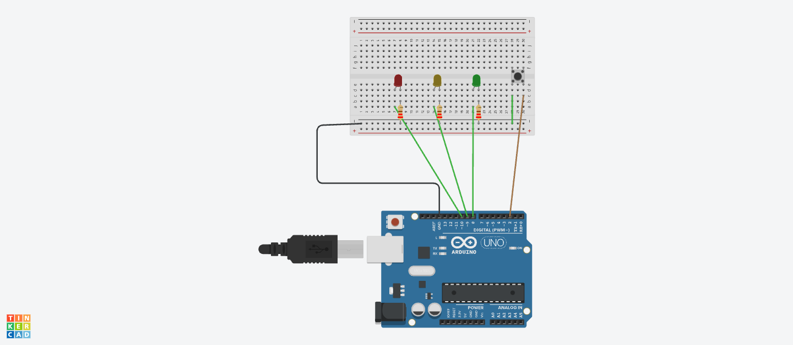

# LED Control Project

## Introduction

This project involves controlling LEDs using an **Arduino Uno** microcontroller. It is designed to help understanding the essentials of programming microcontrollers, working with electronic components, and developing a functional device.

## Hardware Components

The following components are required to complete the project:

- Arduino Uno microcontroller
- ON/OFF switch
- 3 LEDs (Red, Green, and Yellow)
- 3 Resistors (220 Ohms)
- Breadboard
- Jumper wires

## Project Objective

### Mandatory Part
- **Green LED**: Initially turned on by default. Pressing the button will turn off the green LED.
- **Red and Yellow LEDs**: Once the green LED is turned off, the red and yellow LEDs will start blinking every second.

### Bonus Part
1. **Red and Yellow LEDs** blink alternately every two seconds.
2. **Red LED** blinks every half second, and the **Yellow LED** blinks every two seconds.

## Circuit Diagram

## Software and Code

The code is split into separate files for each part of the project. You can find the code for each section by clicking on the relevant links below:

- [Mandatory Part Code](Mandatory_code.ino)
- [Bonus Part 1 Code](Bonus_Part1.ino)
- [Bonus Part 2 Code](Bonus_Part2.ino)

## Resources

- [Resistor](https://eepower.com/resistor-guide/resistor-fundamentals/what-is-a-resistor/#)
- [Resistor-color-code](https://www.allaboutcircuits.com/tools/resistor-color-code-calculator/)
- [Microcontroller](https://www.techtarget.com/iotagenda/definition/microcontroller)
- [Breadboard](https://www.sciencebuddies.org/science-fair-projects/references/how-to-use-a-breadboard)
- [Jumper wires](https://blog.sparkfuneducation.com/what-is-jumper-wire)
- [Definition and Difference Between Anode and Cathode](https://www.vedantu.com/chemistry/cathode-and-anode)
