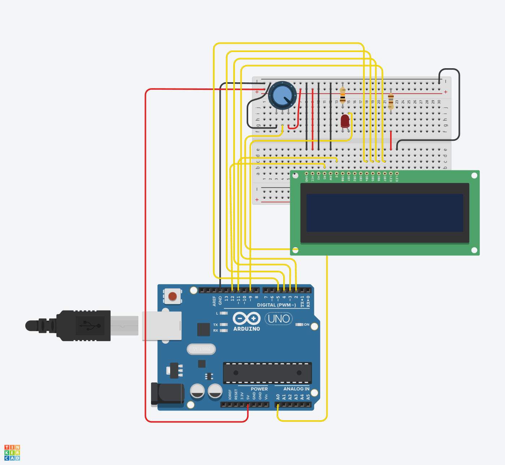

# LCD Control Project

## Introduction

Connections between an Arduino Uno and a 16x2 LCD (Liquid Crystal Display).
The Arduino controls the LCD display by sending commands and data over the data bus (DB0-DB7 or DB4-DB7 in 4-bit mode).
The potentiometer adjusts the contrast of the LCD, making the characters more or less visible.
The resistors protect the components from excessive current, especially the LED backlight and any connected LEDs.

## Hardware components

The following components are required to complete the project:

- A microcontroller (ARDUINO UNO)
- LCD Display
- Resistors 180 ohm, 10k ohm LED
- A breadboard
- Jumper wires

## Project Objective

### Mandatory Part

The LCD display should display the potentiometer value which corresponds to
the brightness the LED.

The LCD display should be updated in real-time as the potentiometer value
changes.

### Bonus Part

Should be able to control the brightness of the LED from the computer via
the Arduino terminal instead of the potentiometer.

## Circuit Diagram

- [Explanation of schematic](schematic.txt)

## Software and Code

The code for mandatory part and bonus part are at the same code.
You can find the code by clicking on the relevant link below:

- [Mandatory part + Bonus Part Code](lcd_control.ino)

## Resources

- (Liquid Crystal Displays (LCD) with Arduino)[https://docs.arduino.cc/learn/electronics/lcd-displays/]
